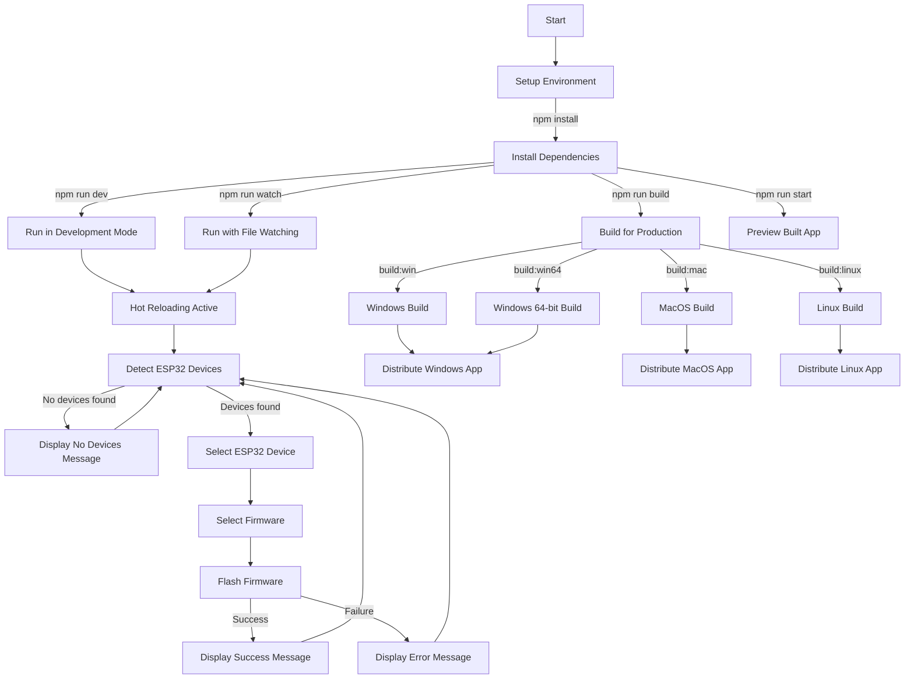

# ESP32-Flasher-React Workflow

This diagram illustrates the workflow of the ESP32-Flasher-React application, including:

1. **Setup Process**: Installing dependencies with npm
2. **Development Paths**: Running in development mode with hot reloading or watching for changes
3. **ESP32 Interaction Flow**: Detecting devices, selecting firmware, and flashing process
4. **Build Process**: Creating production builds for different platforms (Windows, macOS, Linux)
5. **Preview**: Previewing the built application

The diagram shows how users can navigate through different paths depending on their needs, from development to production builds.